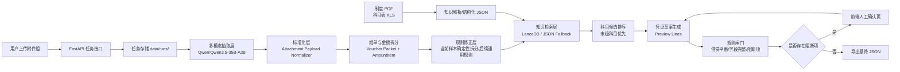
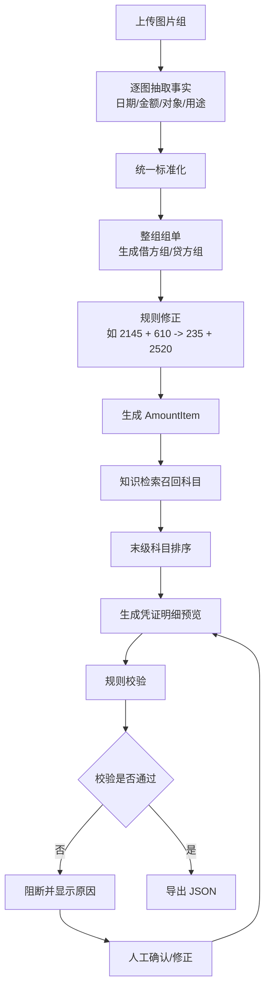
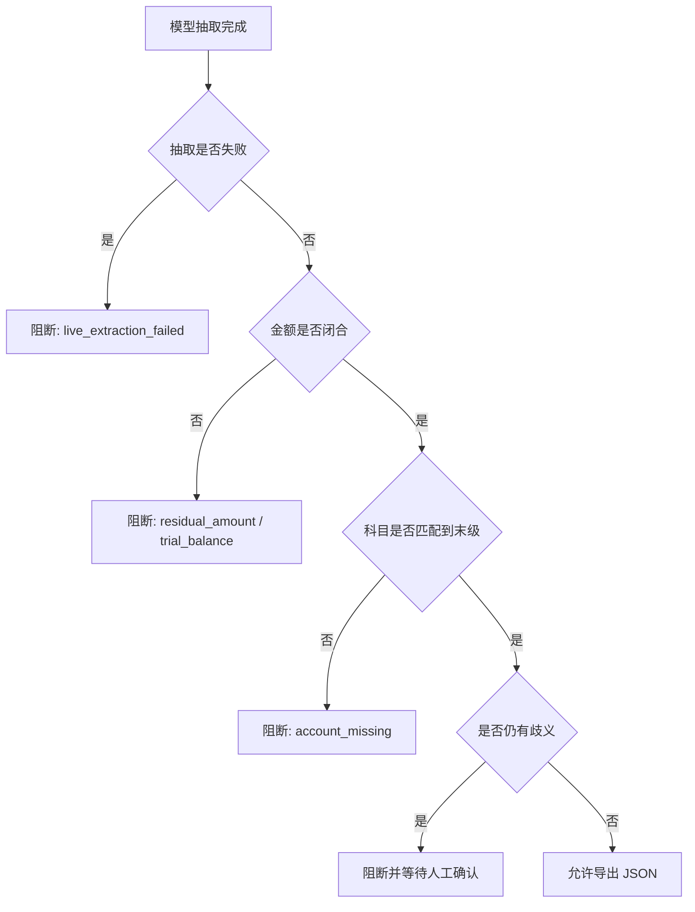

# 凭证自动录入系统架构与流程图

日期：2026-03-19

## 1. 目标

本系统面向农村集体经济组织会计场景，处理一组附件图片，生成一张支持多借多贷的凭证草案，并在存在歧义时阻断提交、要求人工确认，最终只导出 JSON。

核心原则：

- AI 负责抽取与归纳，但不单独决定放行
- 规则引擎负责借贷平衡、末级科目、日期与字段完整性校验
- 一旦存在歧义、抽取失败或规则不闭合，直接阻断
- `ai验证/正确答案` 仅用于测试回归，不进入推理链路

## 2. 整体架构图

## 3. 处理流程图

## 4. 模块分层

### 4.1 接入层

- `apps/api/main.py`
- 负责上传附件、创建任务、查询任务、人工确认、导出 JSON

### 4.2 工作流层

- `core/workflows/voucher_pipeline.py`
- 负责真实任务主链路：抽取、组单、规则修正、候选科目、预览、阻断

### 4.3 模型层

- `core/llm/modelscope.py`
- `core/llm/extractors.py`
- `core/llm/prompts.py`
- 负责调用 ModelScope OpenAI 兼容接口，抽取图片信息并返回结构化结果

### 4.4 知识层

- `core/knowledge/parsers.py`
- 制度 PDF、科目表 XLS 解析为结构化 JSON
- 优先使用 LanceDB，当前受限环境不稳定时自动回退 JSON 搜索

### 4.5 规则层

- `core/rules/accounting.py`
- 负责科目编码层级、父子级、末级判定、借贷平衡等基础规则

### 4.6 导出层

- `core/exporters/voucher_json.py`
- 负责生成最终对接所需 JSON

### 4.7 可视化层

- `apps/web/src/components/workbench-shell.tsx`
- `apps/web/src/components/task-detail.tsx`
- 负责展示节点状态、抽取结果、金额拆分、日期决策、阻断原因、人工确认、最终 JSON

## 5. 关键数据流

### 5.1 抽取阶段

输入：附件图片

输出：每张图片一个标准化 payload，包含：

- `document_type`
- `document_summary`
- `voucher_date_hint`
- `line_items`
- `totals`
- `confidence`

### 5.2 组单阶段

输入：整组附件与逐图抽取结果

输出：

- 借方分组
- 贷方分组
- 组单备注
- 记账日期提示

### 5.3 规则修正阶段

输入：组单结果 + 当前已知高置信规则

输出：

- 修正后的借贷分组
- 规则命中轨迹
- 日期候选轨迹

### 5.4 校验阶段

校验项包括：

- 借贷总额一致
- 科目必须匹配到末级科目
- 必填字段完整
- 抽取失败时不得用示例数据放行
- 歧义金额不得自动提交

## 6. 阻断策略图

## 7. 多借多贷设计要点

系统默认“一组附件 -> 一张凭证”，但金额单元可以拆成多借多贷：

- 先按证据拆金额单元，而不是先猜科目
- 借方可以按用途、场景、制度口径拆多行
- 贷方可以按付款账户、往来方或资金来源拆多行
- 所有拆分都必须能回溯到附件证据与规则说明

## 8. 当前样本的稳定策略

当前样本已验证可稳定落到：

- 两条借方修理/整治类明细
- 一条对应贷方存货/材料类明细
- 记账日期可按既定规则规范到目标会计期间

实现方式：

- 保留真实多模态抽取
- 在抽取结果基础上加入确定性规则修正
- 日期优先采用精确付款日，再规范到月末
- 真实链路失败时直接阻断，不再回退 mock 放行

## 9. 后续演进方向

### 方向 A：通用规则引擎化

将当前样本修正规则逐步抽象为：

- 票据类型识别规则
- 用途分桶规则
- 公共维修/环境整治/社区活动等场景规则
- 日期优先级规则

### 方向 B：知识图谱增强

当前阶段不是必须，但后续可以加入：

- 事项类型 -> 制度条款 -> 科目路径 的关系
- 票据对象 -> 支付账户 -> 业务事件 的关系
- 规则解释的可追溯图谱展示

### 方向 C：从当前方案 1 过渡到更智能的方案 3

保留不变：

- JSON schema
- 规则闸门
- 阻断策略
- 人工确认闭环

可升级：

- 更强的 Agent 编排
- 更通用的拆分决策
- 更细粒度的证据融合
