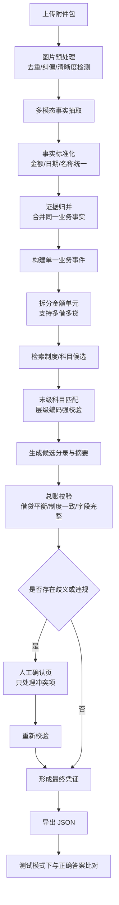

# 自动录入凭证系统设计

日期：2026-03-19

## 1. 目标与范围

本项目面向一组由用户上传的业务材料图片，自动生成 1 张凭证，支持多借多贷，并最终导出符合接口要求的 JSON。

系统必须满足以下要求：

- 多模态模型用于理解图片内容，但不直接决定最终凭证。
- 借贷金额总额必须一致。
- 会计科目必须在 `ai验证/会计科目表 (1).xls` 的层级体系下匹配到可入账的末级科目。
- 全流程必须可视化，且每一步可追溯、可解释。
- 若存在歧义，系统必须阻断并进入人工确认，以此保障业务上的“100%准确率”。

本期交付只要求最终生成 JSON，不接入真实凭证提交接口。

## 2. 输入、参考与边界

### 2.1 输入

- `ai验证/附件/`：当前测试输入图片。

### 2.2 可参与推理的知识

- `ai验证/农村集体经济组织会计制度.pdf`
- `ai验证/会计科目表 (1).xls`

### 2.3 仅作参考，不参与答案推理

- `ai验证/凭证列表 (2).xls`：凭证格式参考。

### 2.4 仅作验收，不参与推理

- `ai验证/正确答案/`

为避免数据泄漏，`正确答案` 不得进入召回、重排、提示词、样例库或任何推理链路。

## 3. 总体方案

采用“固定主流程 + 可插拔智能节点”的方案。

- 当前落地方案：`LangGraph` 显式工作流 + 会计规则引擎 + `LanceDB` 检索增强。
- 未来可演进为：部分节点升级为 agent，但不改变核心数据契约与规则放行闸门。

本期推荐实现路线：

- 后端：`FastAPI + Python 3.13`
- 前端：`Next.js + TypeScript`
- 工作流：`LangGraph`
- 向量库：`LanceDB`
- 向量模型：本地 `bge-m3`
- 主模型：ModelScope API `Qwen/Qwen3.5-35B-A3B`
- 数据校验：`Pydantic v2`
- 本地状态存储：`SQLite`

## 4. 核心业务原则

- 一次上传的一组图片，默认生成 1 张凭证。
- 一张凭证内部允许多借多贷。
- AI 只负责生成候选事实、候选摘要、候选科目。
- 最终放行权只在规则引擎和人工确认层。
- 不能证明正确就阻断，不允许不确定时自动导出。

## 5. 整体架构

```mermaid
flowchart TB
    U[用户上传一组图片] --> W[Web UI<br/>任务页/流程图/人工确认页/凭证预览页]
    W --> API[FastAPI API]
    API --> LG[LangGraph 工作流引擎]

    subgraph AI[智能与规则层]
        LG --> MM[多模态抽取<br/>Qwen/Qwen3.5-35B-A3B<br/>ModelScope API]
        LG --> RE[会计规则引擎<br/>末级科目/借贷平衡/阻断规则]
        LG --> SUM[摘要生成器]
    end

    subgraph KNOW[知识层]
        K1[制度 PDF]
        K2[科目表 Excel]
        K3[格式参考 Excel]
        K4[人工确认后历史样本]
        PARSE[知识解析与结构化]
        VDB[LanceDB]
        EMB[bge-m3 本地向量模型]
        REL[轻量关系层<br/>image-fact-amount-account-rule]
        K1 --> PARSE
        K2 --> PARSE
        K3 --> PARSE
        K4 --> PARSE
        PARSE --> VDB
        EMB --> VDB
        PARSE --> REL
    end

    MM --> FACT[事实层<br/>日期/金额/用途/对象/票据号]
    FACT --> SPLIT[金额单元拆分<br/>AmountItem]
    SPLIT --> RET[候选科目召回]
    VDB --> RET
    REL --> RET
    RET --> RE
    RE --> POST[候选分录]
    SUM --> POST
    POST --> REVIEW{是否存在阻断项}
    REVIEW -- 否 --> VCH[凭证草案]
    REVIEW -- 是 --> HR[人工确认]
    HR --> RECHECK[重新校验]
    RECHECK --> VCH
    VCH --> JSON[导出最终凭证 JSON]

    subgraph DATA[本地数据层]
        DB[SQLite<br/>任务/节点/审计]
        FILES[data/runs<br/>上传件/中间产物/导出结果]
        GT[ground_truth<br/>仅测试比对 禁止参与推理]
    end

    API --> DB
    API --> FILES
    JSON --> FILES
    GT -.仅测试断言.-> LG
```



## 6. 处理流程



## 7. 模块划分

### 7.1 Web UI

负责：

- 上传图片
- 展示流程图
- 展示事实抽取结果
- 展示科目匹配与规则解释
- 人工确认阻断项
- 预览最终凭证
- 导出 JSON

### 7.2 Workflow Engine

使用 `LangGraph` 串联主流程，保存节点状态、输入输出快照、耗时与错误信息。

### 7.3 Document AI

调用 ModelScope API 的 `Qwen/Qwen3.5-35B-A3B`，从图片中提取结构化事实，不直接生成最终凭证。

### 7.4 Knowledge Service

基于 `LanceDB + bge-m3` 提供制度条文、科目层级、历史样例的召回能力。

### 7.5 Accounting Rule Engine

负责：

- 科目层级解析
- 末级科目过滤
- 多借多贷金额拆分
- 借贷平衡校验
- 制度一致性校验
- 阻断项生成

### 7.6 Export Service

将最终确认后的凭证对象导出为符合接口要求的 JSON。

## 8. 知识层设计

知识层分为三类：

- 制度知识：`农村集体经济组织会计制度.pdf`
- 科目知识：`会计科目表 (1).xls`
- 样例知识：后续人工确认通过的真实历史任务

当前测试集的 `正确答案` 不能进入样例知识。

### 8.1 存储

- 原始资料：`knowledge/raw/`
- 解析产物：`knowledge/parsed/`
- 向量索引：`knowledge/lancedb/`
- 关系数据：`knowledge/relations/`

### 8.2 检索策略

三段式检索：

1. 语义召回业务相关制度与科目候选
2. 结构过滤，只保留符合层级路径和业务方向的候选
3. 规则重排，优先制度明确条文与人工确认样例

### 8.3 轻量关系层

当前不引入重型图数据库，先维护可图谱化的关系结构：

- `image -> fact`
- `fact -> amount_item`
- `amount_item -> candidate_account`
- `candidate_account -> account_leaf`
- `account_leaf -> institution_rule`
- `voucher_line -> evidence_set`

## 9. 数据模型

### 9.1 任务与输入层

- `Task`
- `Attachment`

### 9.2 事实层

- `ExtractedFact`
- `EvidenceGroup`

### 9.3 业务事件与金额单元

- `BusinessEventDraft`
- `AmountItem`

### 9.4 会计候选层

- `AccountCandidate`
- `PostingCandidate`

### 9.5 校验与阻断层

- `ValidationResult`
- `Blocker`

### 9.6 人工确认层

- `HumanReviewAction`
- `ReviewResolution`

### 9.7 导出层

- `VoucherDraft`
- `VoucherLine`
- `VoucherExportPayload`

## 10. 会计规则引擎设计

### 10.1 科目层级匹配

- 科目代码按层级解析，例如 `AAA BB CC DD`
- 父级科目只作导航，不直接作为入账结果
- 只有末级且可入账节点才允许落账
- 选择优先级：
  - 制度明确映射
  - 历史人工确认样例
  - 科目语义相似度
  - 模型建议

若存在多个合理末级科目但证据不足以区分，则阻断，转人工确认。

### 10.2 多借多贷拆分

- 一次上传固定生成 1 张凭证
- 凭证内部行数不限
- 拆分依据是“证据中可独立成立的金额单元”
- 子金额之和必须严格闭合到业务总额

### 10.3 借贷平衡

必须同时满足：

- 借方合计 = 贷方合计
- 分录合计 = 证据支持总额
- 每条金额均可追溯到来源证据

### 10.4 摘要规则

- 摘要按分录生成
- 摘要需体现真实业务用途
- 禁止空泛摘要
- 摘要应与金额、科目、证据互相印证

### 10.5 阻断规则

包括但不限于：

- 科目不是末级
- 同一金额存在多个互斥解释
- 借贷不平
- 日期无法统一
- 摘要无法体现业务实质
- 附件张数无法解释

## 11. LangGraph 节点设计

推荐节点如下：

- `create_task`
- `ingest_attachments`
- `preprocess_images`
- `extract_facts_multimodal`
- `normalize_facts`
- `merge_evidence`
- `build_business_event`
- `split_amount_items`
- `retrieve_account_candidates`
- `rank_leaf_accounts`
- `draft_postings`
- `generate_summaries`
- `validate_voucher`
- `review_gate`
- `human_review`
- `assemble_voucher`
- `export_json`
- `evaluate_against_ground_truth`（仅测试模式）

### 11.1 必须完全可视化的节点

- `extract_facts_multimodal`
- `merge_evidence`
- `split_amount_items`
- `retrieve_account_candidates`
- `rank_leaf_accounts`
- `validate_voucher`
- `human_review`

### 11.2 未来可升级为 agent 的节点

- `extract_facts_multimodal`
- `merge_evidence`
- `generate_summaries`
- `retrieve_account_candidates`

升级时必须保持输入输出 schema 不变，规则放行闸门不变。

## 12. 可视化界面设计

建议页面：

- 任务首页
- 材料上传与预处理页
- 工作流流程图页
- 事实抽取页
- 业务归并与金额拆分页
- 科目匹配与规则解释页
- 人工确认页
- 最终凭证预览页
- 调试与审计页

重点要求：

- 每个节点可展开查看输入、输出、耗时、错误、规则命中说明
- 每条分录可反查证据来源与制度依据
- 仅高亮待确认项，减少人工负担

## 13. 目录结构建议

```text
.
├─ apps/
│  ├─ api/
│  └─ web/
├─ core/
│  ├─ exporters/
│  ├─ knowledge/
│  ├─ llm/
│  ├─ rules/
│  ├─ schemas/
│  └─ workflows/
├─ data/
│  └─ runs/
├─ docs/
│  └─ plans/
├─ knowledge/
│  ├─ lancedb/
│  ├─ parsed/
│  ├─ raw/
│  └─ relations/
├─ models/
├─ reference/
├─ tests/
├─ venv/
└─ .env
```

## 14. 配置设计

统一在 `.env` 中配置：

```env
MODELSCOPE_API_KEY=
MODELSCOPE_BASE_URL=
MODELSCOPE_CHAT_MODEL=Qwen/Qwen3.5-35B-A3B

EMBEDDING_MODEL_PATH=F:\\models\\modelscope\\models\\Xorbits\\bge-m3
LANCEDB_URI=./knowledge/lancedb
SQLITE_PATH=./data/app.db
DATA_DIR=./data
KNOWLEDGE_DIR=./knowledge
REFERENCE_DIR=./reference
TEST_INPUT_DIR=./test_input
GROUND_TRUTH_DIR=./ground_truth

DEFAULT_LB=1
DEFAULT_ORGNOW=320282105231000
DEFAULT_MENU=21
DEFAULT_SYS=3
```

## 15. 测试与验收

### 15.1 测试分层

- 单元测试：编码层级、末级过滤、借贷平衡、JSON schema
- 集成测试：知识入库、检索、抽取规范化、工作流节点衔接
- 端到端测试：上传测试图片，导出 JSON，与正确答案做字段级比较

### 15.2 验收标准

对当前测试集：

- 自动结果完全匹配正确答案，视为通过
- 若系统识别到歧义并阻断，经人工确认后输出正确结果，也视为通过
- 若系统未阻断却导出错误 JSON，视为失败

### 15.3 可视化验收

必须能在界面中看到：

- 每张图抽取出的事实
- 每个金额单元如何形成
- 每条分录如何映射到最终科目
- 规则命中与阻断原因
- 人工确认前后差异

## 16. 开发阶段

### 阶段 1

- 建立项目骨架
- 创建 `venv`
- 配置 `.env`
- 初始化前后端与基础页面

### 阶段 2

- 解析制度 PDF 与科目表
- 建立 `LanceDB`
- 实现科目层级解析与末级匹配规则

### 阶段 3

- 接入多模态抽取
- 建立事实层、金额单元拆分、候选分录生成

### 阶段 4

- 完成人工确认页
- 完成 JSON 导出
- 建立端到端回归测试

### 阶段 5

- 提升解释能力
- 优化节点日志
- 为方案 3 的 agent 化升级预留接口

## 17. 后续演进

未来若升级到更智能的方案 3，原则如下：

- 保持 LangGraph 主流程不变
- 保持规则引擎不变
- 逐步将部分节点替换为 agent 能力
- 所有升级都不得绕过末级科目校验、借贷平衡校验与阻断机制

## 18. 当前已确认结论

- 一组图片默认生成 1 张凭证
- 凭证内部支持多借多贷
- 最终只需导出 JSON
- 可视化过程必须完整
- `正确答案` 只作验收，不作样例
- 知识层使用 `LanceDB`
- 当前不引入重型知识图谱，但保留轻量关系层
- 主模型使用 ModelScope API `Qwen/Qwen3.5-35B-A3B`
- 向量模型复用本地 `bge-m3`
- Python 使用 `3.13`，并在根目录创建 `venv`
